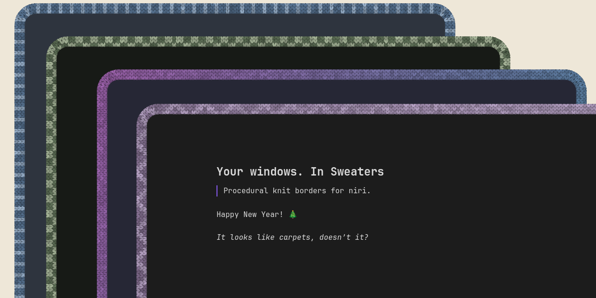
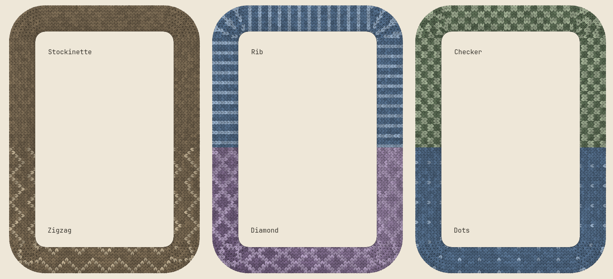
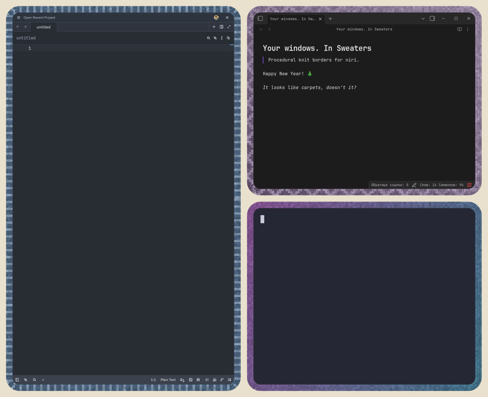

<div align="center">
  <h1>niri-sweaters</h1>
  <p><strong>Your windows. In sweaters.</strong></p>
  
  <p>A <a href="https://github.com/niri-wm/niri">niri</a> fork with knitted window borders and desktop zoom.<br>Choose a pattern and colours for each app, magnify your desktop, and mark regions for recording.</p>
  <p>
    <a href="#features">Features</a> ·
    <a href="#choose-your-knit">Patterns</a> ·
    <a href="#in-action">In action</a> ·
    <a href="#desktop-zoom-in-action">Zoom demo</a> ·
    <a href="#select-and-frame-a-region">Region IPC</a> ·
    <a href="#try-it">Try it</a> ·
    <a href="#build-from-scratch">Build</a> ·
    <a href="#configure-it">Configure</a> ·
    <a href="#status">Status</a>
  </p>
</div>

## Features

- **Knitted borders.** Choose from six patterns, with per-app colours and live configuration reloads.
- **Desktop Zoom.** Magnify the desktop with keyboard actions, mouse-wheel bindings, or opt-in touchpad pinch gestures.
- **Follow or lock.** Let the viewport follow the pointer outside a configurable deadzone, or lock it in place.
- **Momentary zoom.** Hold a shortcut to zoom in; release it to restore the previous view.
- **Continuous Overview.** Move from the magnified view into Overview with simultaneous scaling and centering, without an intermediate desktop reset.
- **Region IPC.** Select a rectangle for its coordinates without taking a screenshot, then show or clear a fixed recording frame on that monitor.
- **Separate session.** Install alongside stock Niri without replacing its session or configuration.

## Choose your knit



## In action

[](docs/assets/knit-desktop.png)

[Example configuration](resources/knit-preview.kdl)

## Desktop Zoom in action

<video controls width="800" src="docs/assets/zoom_demonstration.mp4">
  <a href="docs/assets/zoom_demonstration.mp4">Watch the Desktop Zoom demonstration (MP4, 56 seconds)</a>
</video>

[Open or download the Desktop Zoom demonstration (MP4, 56 seconds)](docs/assets/zoom_demonstration.mp4)

GitHub does not render inline video in repository READMEs; use the MP4 link above when viewing this page there.

Zoom in for a closer look, navigate the magnified desktop, and enter Overview without first snapping back to the normal desktop. The pointer stays in place during the Overview transition.

[Zoom setup and controls](docs/wiki/Accessibility.md) · [Zoom key bindings](docs/wiki/Configuration:-Key-Bindings.md#zoom)

The recording uses HEVC; if your browser cannot play it, download it and open it in a compatible video player.

## Select and frame a region

Use the IPC commands from your Niri Sweaters session to get coordinates without changing the clipboard or taking a screenshot:

```sh
niri-sweaters msg select-region --format slurp  # drag on one monitor; global logical coordinates
niri-sweaters msg --json select-region           # output name and output-local logical coordinates
```

Press **Escape** to cancel. To mark a fixed region, use the output name and output-local coordinates from the JSON result (replace the example values):

```sh
niri-sweaters msg region-frame set --output DP-1 --x 100 --y 80 --width 800 --height 600 --color red
niri-sweaters msg region-frame clear
```

The frame stays on its monitor across zoom and Overview but is excluded from screenshots and screencasts. [IPC formats and frame controls](docs/wiki/IPC.md#region-selection-and-recording-frame)

## Try it

Install **Niri Sweaters** alongside your existing Niri session, without replacing it.

### Linux (systemd)

Install [stable Rust](https://rustup.rs/), Git, and the [build dependencies](docs/wiki/Getting-Started.md#building). The installer builds from source and uses `run0` or `pkexec` for system installation.

```sh
git clone https://github.com/TOwInOK/niri-sweaters.git
cd niri-sweaters
./scripts/install-niri-sweaters
```

Log out, choose **Niri Sweaters** in your display manager, and log back in. Then [enable knitted borders](#configure-it).

### NixOS

Add the input and module to your existing system flake:

```nix
{
  inputs.niri-sweaters.url = "github:TOwInOK/niri-sweaters";

  outputs = { nixpkgs, niri-sweaters, ... }: {
    nixosConfigurations.your-host = nixpkgs.lib.nixosSystem {
      system = "x86_64-linux";
      modules = [
        ./configuration.nix
        niri-sweaters.nixosModules.default
      ];
    };
  };
}
```

Keep your existing inputs and modules; use your own hostname and architecture. From your system flake directory, rebuild:

```sh
sudo nixos-rebuild switch --flake .#your-host
```

Log out, select **Niri Sweaters**, and [enable knitted borders](#configure-it). The module leaves `programs.niri` unchanged.

**Your config:** on first login, the session copies `~/.config/niri/` to `~/.config/niri-sweaters/`, including relative includes and the contents of symlinks. Existing destination files are never overwritten. If no niri config exists, it uses the bundled default. Both paths respect `XDG_CONFIG_HOME`; absolute includes still point to their original files.

<details>
<summary>Reinstall or remove (Linux installer)</summary>

Run from the repository root:

```sh
# Install an already-built release binary.
./scripts/install-niri-sweaters --skip-build

# Preview system installation without changing files.
./scripts/install-niri-sweaters --skip-build --dry-run

# Remove this fork's installed files after leaving its session.
./scripts/uninstall-niri-sweaters
```

Your configs and stock Niri installation are kept. On NixOS, remove the module and input from your flake and rebuild instead.

</details>

## Build from scratch

For a manual build and a preview without installing a session, clone the repository as above and install the [Rust toolchain](https://rustup.rs/) and [build dependencies](docs/wiki/Getting-Started.md#building). From the repository root:

```sh
cargo build --release --locked
./target/release/niri validate --config resources/knit-preview.kdl
./target/release/niri --config resources/knit-preview.kdl
```

With Nix, use these commands instead:

```sh
nix build .#niri-sweaters
./result/bin/niri-sweaters validate --config resources/knit-preview.kdl
./result/bin/niri-sweaters --config resources/knit-preview.kdl
```

Run the preview from an **existing Wayland session** with [Ghostty](https://ghostty.org/) installed. It opens a nested desktop with three sample windows, without loading your personal niri config. On non-NixOS systems, the Nix build may need [NixGL](docs/wiki/Getting-Started.md#nixosnix).

**Alt + Left / Right** switches columns; **Alt + R** resizes; **Alt + Shift + E**, then **Enter**, exits. A manual build does not install a login session.

## Configure it

Merge this into the existing `layout` section of `~/.config/niri-sweaters/config.kdl` (or `$XDG_CONFIG_HOME/niri-sweaters/config.kdl`):

```kdl
layout {
    focus-ring { off; }
    border {
        on
        width 24
        active-color "#465440"
        inactive-color "#384136"
        knit {
            on
            pattern "checker"
            accent-color "#bac6a6"
        }
    }
}
```

Changes reload live. `knit` belongs to `border`, not `focus-ring`; `knit { off; }` restores ordinary borders. Validate with `niri-sweaters validate --config /path/to/config.kdl`, not stock `niri`.

[Tuning guide](docs/wiki/Knitted-Border-Tuning.md) · [All knit options](docs/wiki/Configuration:-Layout.md#procedural-knit-border) · [Per-app rules](docs/wiki/Configuration:-Window-Rules.md#focus-ring-and-border) · [Example configuration](resources/knit-preview.kdl)

## Why a fork?

Knitted borders are rendered inside niri, so they follow window geometry, rounded corners, and animations without separate overlay windows. The scrollable layout and the rest of the compositor are niri's work.

## Status

Experimental. Tested on an NVIDIA GeForce RTX 3070. Performance optimizations are included; broader GPU/driver testing and end-to-end benchmarks are still needed.

## Credits and license

Based on [niri](https://github.com/niri-wm/niri) by Ivan Molodetskikh and the niri contributors. Inspired by [window-sweaters](https://github.com/saragordic/window-sweaters).

[GPL-3.0-or-later](LICENSE).
