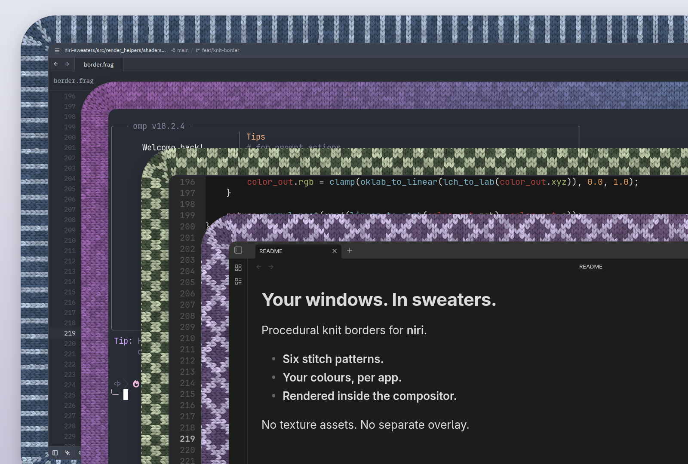
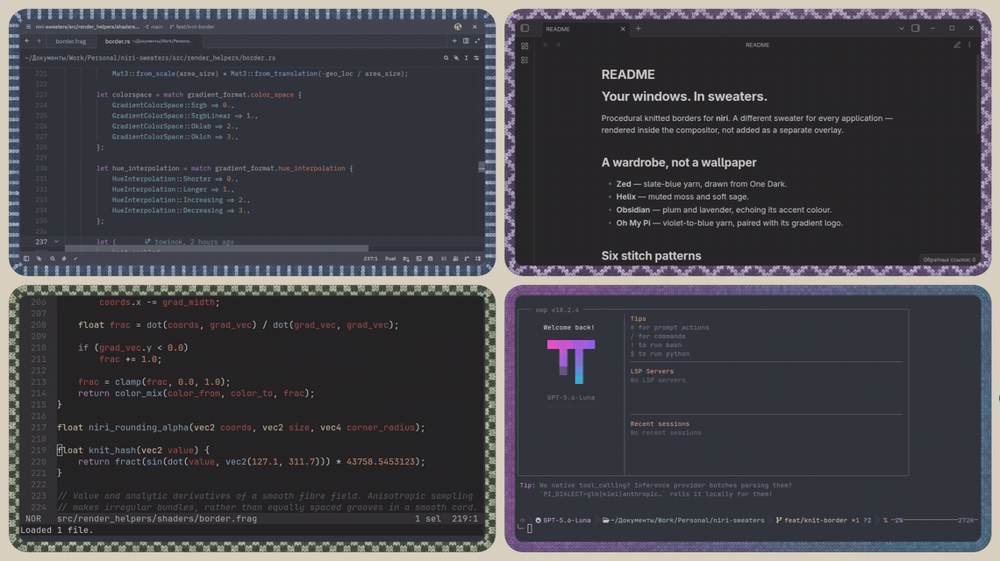
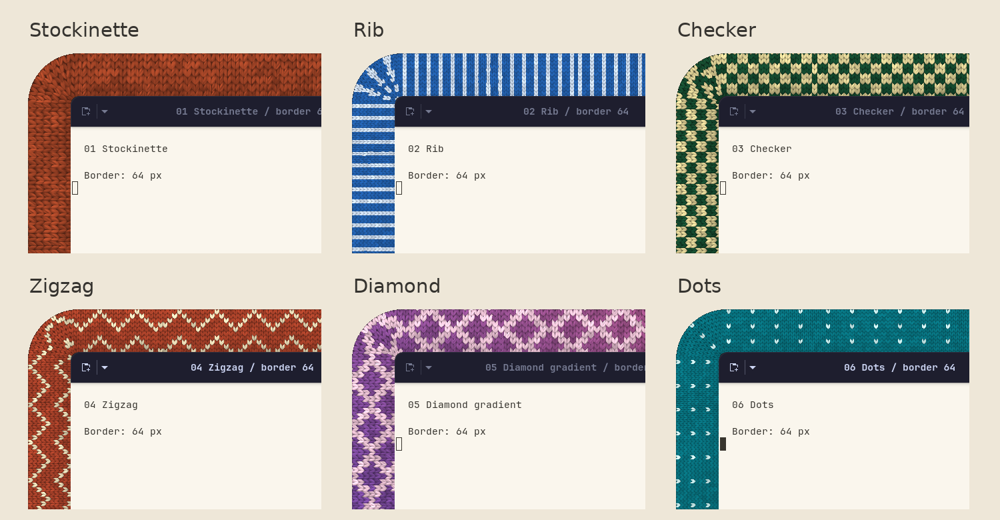

# niri-sweaters

**Your windows. In sweaters.**

A fork of [niri](https://github.com/niri-wm/niri) that wraps your windows in procedural knitted borders. Pick a stitch, match the yarn to your app, and keep your scrollable-tiling workflow.



*Real Zed, Oh My Pi, Helix, and Obsidian windows, composed from niri captures. 64 px borders for the close-up.*

- **Knitted, not wallpapered.** Loops, lighting, and short fibres are generated in the border shader. No texture assets.
- **Part of the compositor.** These are niri borders, not separate overlay windows.
- **A sweater for every app.** Override patterns and palettes with ordinary KDL window rules.
- **Your kind of yarn.** Tune stitch size, relief, and fuzz; use solid colours or gradients as the base yarn.

[In action](#in-action) · [Patterns](#choose-your-knit) · [Try it](#try-it) · [Configuration](#configure-it) · [Why a fork?](#why-a-fork) · [Status](#status)

## In action



*Real applications, 24 px borders. [Open the full-resolution desktop screenshot.](docs/assets/knit-desktop.png)*

The colours come from the windows, not just their logos:

| Application | Stitch | Yarn palette |
| --- | --- | --- |
| Zed | `rib` | Slate blue, paired with One Dark |
| Helix | `checker` | Muted moss and sage, echoing its syntax colours |
| Obsidian | `diamond` | Plum and lavender, paired with its purple accent |
| Oh My Pi | `stockinette` | Violet-to-blue gradient, echoing its logo |

The [preview configuration](resources/knit-preview.kdl) includes these application rules.

## Choose your knit



Six built-in patterns: `stockinette`, `rib`, `checker`, `zigzag`, `diamond`, and `dots`. Use one throughout your desktop or mix them per application. The close-ups above use 64 px borders; the width is configurable independently of stitch size.

## Try it

### Build and open a safe preview

1. Download **this fork** using GitHub's **Code → Download ZIP**, or clone it. Extract it if needed and open a terminal in the project directory.
2. Install a current stable [Rust toolchain](https://rustup.rs/), the [build dependencies for your distribution](docs/wiki/Getting-Started.md#building), and [Ghostty](https://ghostty.org/) for the sample windows. [Nix build instructions](docs/wiki/Getting-Started.md#nixosnix) are also available.
3. From an **existing Wayland session**, run:

```sh
cargo build --locked
./target/debug/niri validate --config resources/knit-preview.kdl
./target/debug/niri --config resources/knit-preview.kdl
```

This opens niri inside a window. The standalone preview config does **not** load your personal niri configuration or replace your current session. It opens three lightweight Ghostty samples; Zed, Helix, Obsidian, and OMP are not required for this first look.

Inside the preview:

- **Alt + Left / Right** — switch columns.
- **Alt + R** — cycle column widths.
- **Alt + Return** — open another terminal.
- **Alt + Shift + E**, then **Enter** — quit.

`Mod` means `Alt` in nested niri. The same bindings use `Super` in a regular niri session.

### Use it as your compositor

Build an optimized binary:

```sh
cargo build --release --locked
```

Follow the [manual installation and session instructions](docs/wiki/Getting-Started.md#manual-installation), using **this fork's** `target/release/niri`. An upstream distro package does not contain the knit renderer. Keep your existing session available while trying the fork.

### Install a separate Niri Sweaters session

`cargo build` only creates a binary. To install the optimized build and add this fork as a separate option in your display manager, run from the repository root:

```sh
./scripts/install-niri-sweaters
```

The installer builds `target/release/niri`, verifies that it accepts the bundled knit configuration, installs it as `niri-sweaters`, registers the matching systemd user units and Wayland session entry, and leaves the regular `Niri` session untouched. It uses `run0` when available and falls back to `pkexec` for the system-wide files. When Noctalia Greeter is available, it also checks that the greeter discovers `Niri Sweaters`.
The stock `niri` command remains untouched and will reject fork-only directives. Validate such configs with `niri-sweaters validate` instead.

For a repeat installation when the release binary is already built:

```sh
./scripts/install-niri-sweaters --skip-build
```

Preview the privileged file operations without changing the system:

```sh
./scripts/install-niri-sweaters --skip-build --dry-run
```

To remove only the files installed by this fork:

```sh
./scripts/uninstall-niri-sweaters
```

The uninstall script refuses to remove an active Niri Sweaters session and does not touch the stock Niri installation.

#### NixOS flake

Add this repository as an input and import its module:

```nix
{
  inputs.niri-sweaters.url = "github:TOwInOK/niri-sweaters";

  outputs = { nixpkgs, niri-sweaters, ... }: {
    nixosConfigurations.your-host = nixpkgs.lib.nixosSystem {
      system = "x86_64-linux";
      modules = [
        ./configuration.nix
        niri-sweaters.nixosModules.default
      ];
    };
  };
}
```

The module adds `niri-sweaters` to `environment.systemPackages` and `services.displayManager.sessionPackages`. It does not replace `pkgs.niri` or change `programs.niri`, so the display manager shows separate **Niri** and **Niri Sweaters** sessions. The flake also exports `packages.<system>.niri-sweaters` and `overlays.default` for manual integration.

On first login, the Niri Sweaters session creates `~/.config/niri-sweaters/config.kdl` from the bundled default. Stock Niri continues to use `~/.config/niri/config.kdl`. Removing the package does not delete either user config.

## Configure it

Merge this into the `layout` section of `~/.config/niri-sweaters/config.kdl`:

```kdl
layout {
    focus-ring { off; }
    border {
        on
        width 24
        active-color "#465440"
        inactive-color "#384136"
        knit {
            on
            pattern "checker"
            accent-color "#bac6a6"
            stitch-size 8
            relief 0.8
            fuzz 0.35
        }
    }
}
```

`knit` belongs to **`border`**, not `focus-ring`. `stitch-size` controls the size of each loop, `relief` controls its depth and lighting, and `fuzz` extends the material's short pile. Normal active, inactive, and urgent colours or gradients supply the base yarn.

Give an application its own sweater with a top-level rule:

```kdl
window-rule {
    match app-id=r#"^dev\.zed\.Zed$"#
    border {
        active-color "#445873"
        inactive-color "#445873"
        knit {
            pattern "rib"
            accent-color "#aabbd2"
        }
    }
}
```

The [full preview](resources/knit-preview.kdl) also contains Obsidian, Helix, and OMP palettes. Helix and OMP run inside Ghostty, so their rules distinguish fixed terminal titles: launch them with `ghostty --title=Helix -e helix` and `ghostty --title="Oh My Pi" -e omp`. Use `niri msg windows` to check the actual app IDs and titles in your session.

See the [knit option reference](docs/wiki/Configuration:-Layout.md#procedural-knit-border) and [window rules](docs/wiki/Configuration:-Window-Rules.md#focus-ring-and-border) for the complete configuration syntax. Changes reload live; `knit { off; }` returns a window to the standard border renderer.

## Why a fork?

niri already knows each window's geometry, rounded corners, stacking order, and animation state. Rendering the knit inside the compositor lets the border use that information directly. A separate overlay would have to track the window from outside — and cannot simply insert itself beside every window in the scene.

This fork adds the knitted material to niri's border renderer. The scrollable layout and the rest of the compositor are niri's work.

## Status

The knit feature is experimental. The real-app showcase was captured on an NVIDIA GeForce RTX 3070; broader GPU and driver coverage, and comparative performance measurements, are still needed.

The short pile stays within the existing border geometry. It does not create loose fibres outside the window silhouette.

## Credits and license

Based on [niri](https://github.com/niri-wm/niri) by Ivan Molodetskikh and the niri contributors. Inspired by [window-sweaters](https://github.com/saragordic/window-sweaters).

[GPL-3.0-or-later](LICENSE).
