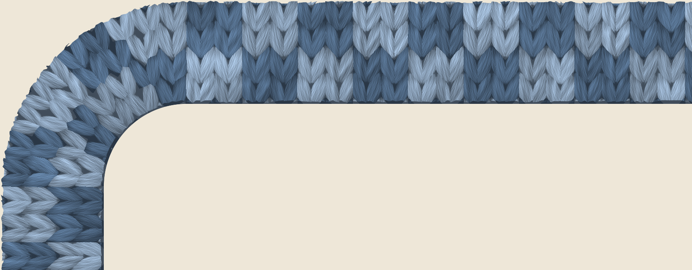
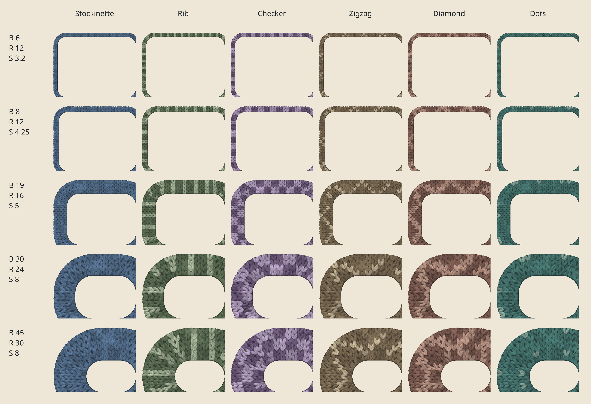
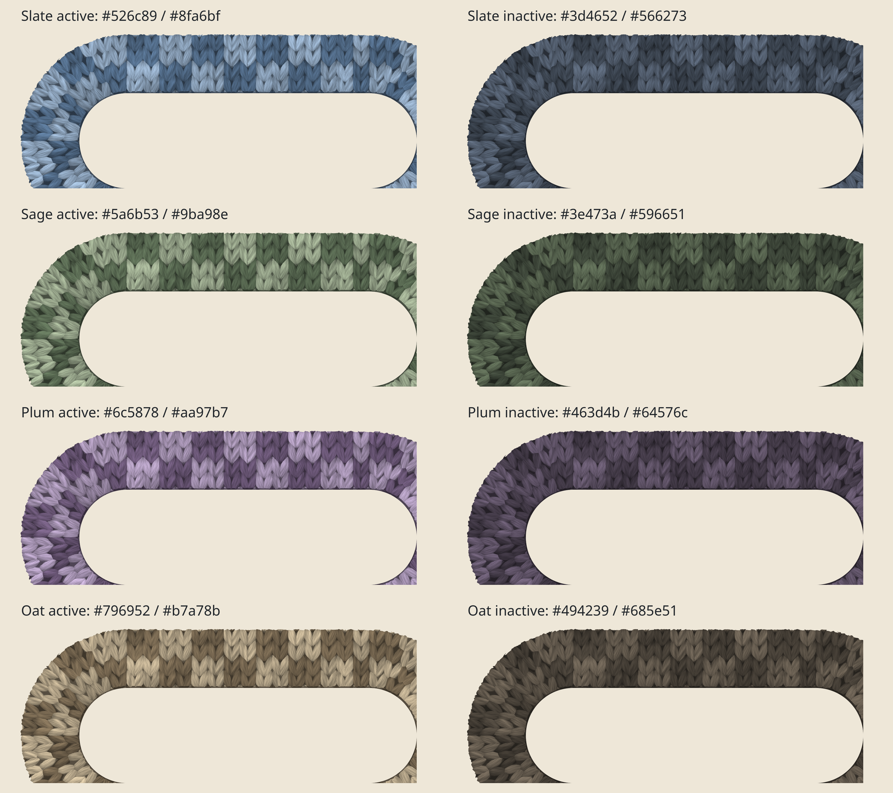

# How to tune a tidy knitted border

For Niri Sweaters: start with the ready-made config, then adjust the sizes and colours. The formulas and short explanations will help you tune the border to your taste.

## 1. Start with this border

[](./img/knit-tuning-start.png)

**Inner radius 24 · border width 30 · stitch size 8.** The outer radius comes out at 54, and about four rows fit across the width.

The rounded corners share the same centre, and the inner curve has room for several stitches. That is why the border looks continuous, with no abrupt transition between the edge and the corner.

_A detailed GPU render at scale 8, with no upscaling. It shows detail larger than a normal desktop view; click to open the original._

Copy the settings below. In an existing config, merge them into your own blocks instead of creating a second `layout`. Place the last rule after your other palette rules.

```kdl
prefer-no-csd
layout {
    focus-ring { off; }
    border {
        on
        width 30
        active-color "#526c89"
        inactive-color "#3d4652"
        urgent-color "#a76745"
        knit {
            on
            pattern "checker"
            accent-color "#8fa6bf"
            stitch-size 8
            relief 0.65
            fuzz 0.15
        }
    }
}
window-rule { geometry-corner-radius 24; clip-to-geometry true; }
window-rule {
    match is-active=false
    border { knit { accent-color "#566273"; }; }
}
```

`clip-to-geometry true` rounds the window itself, not just the border. The last rule mutes the accent of inactive windows. Config changes are picked up live; no session restart is needed.

If you like the result, skip ahead to checking it on your own windows in section 5. For a subtler border, try the width-6 or width-8 variants from the next section.

## 2. Work out your sizes

Pick the parameters in this order: inner radius → border width → stitch size. All sizes below are in logical pixels. A thick border takes up layout space and shrinks the usable window area.

| Symbol | What you choose                         | Setting                   |
| ------ | --------------------------------------- | ------------------------- |
| `R`    | Inner radius                            | `geometry-corner-radius`  |
| `B`    | Border width                            | `width`                   |
| `S`    | Stitch size                             | `stitch-size`             |
| `N`    | Desired number of rows across the width | Used for calculation only |

### Match the inner and outer outlines

For a positive `R` and a window where the rounded corners fit fully:

```text
Outer radius = R + B
```

**Why:** the inner outline is inset by the border width, and its radius is smaller by the same amount. The arcs share a centre, so the band keeps its width through the turn.

The outer radius is not set directly. If you want an outer radius of 48 with a width of 24, set the inner `R = 48 − 24 = 24`.

This is the concentricity principle worth borrowing from Apple. The current shader, however, draws circular corners, not Apple's continuous corners.

### Size the stitch to the row count

Choose how many rows you want to see, then work out the stitch:

```text
S ≈ B / (0.94 × N)
```

**Why:** the shader spaces rows `0.94 × S` apart. This is an estimate: individual strands near the edge may be partially clipped.

`stitch-size` accepts values from **1 to 64**, including fractions. For example, you can compare `7.5`, `8` and `8.5`.

As a starting point for choosing a pattern:

- **`stockinette`, `rib`:** suit a narrow border
- **`checker`, `dots`:** try four rows
- **`zigzag`, `diamond`:** try six rows so the full motif fits across the width

### Check the corner has enough room

For stitches to turn gradually, start with this ratio:

```text
R / S ≈ 2.5–4
```

**Why:** the inner arc is shorter than the outer one. Stitches that are too large fit it only in small numbers and look bunched up.

This is a guideline, not a hard limit. If the corner is tight, reduce `S` or increase `R`. After increasing the radius, check that the clip has not cut off buttons or text.

Do not shrink the stitch indefinitely: on screen it can turn into a fine texture with no distinguishable stitches. Judge the result at 100%, not only zoomed in.

### A full worked example

Say you want width 30, four rows and inner radius 24:

```text
Stitch size:      30 / (0.94 × 4) ≈ 7.98 → pick 8
Corner check:     24 / 8 = 3 → fine
Outer radius:     24 + 30 = 54
```

### Ready-made sizes and every pattern

If you would rather not calculate, copy the values from one row into the starter config:

| Variant                 | Width `B` | Radius `R` | Stitch `S` | Rows, approx. |
| ----------------------- | --------: | ---------: | ---------: | ------------: |
| Thin edging             |         6 |         12 |        3.2 |             2 |
| Thin, more visible knit |         8 |         12 |       4.25 |             2 |
| Compact                 |        19 |         16 |          5 |             4 |
| Balanced                |        30 |         24 |          8 |             4 |
| Large motif             |        45 |         30 |          8 |             6 |

[](./img/knit-tuning-size-patterns.png)

<!--*One palette per column, with no active/inactive or background alternation. All cells use `relief 0.65` and `fuzz 0.15`. These are GPU renders at scale 5, not the scale-1 view. Click to open the 4000 × 2740 px original.*-->

### For widths 6 and 8

On a narrow border, start with **two rows**, `stockinette`, `relief 0.6` and `fuzz 0`. If you want a coloured motif, try `rib` with a low-contrast accent.

- **Width 6:** `R 12`, `S 3.2`. Outer radius 18, ratio `R / S = 3.75`
- **Width 8:** `R 12`, `S 4.25`. Outer radius 20, ratio `R / S ≈ 2.82`

**Why not four rows:** they would need stitches of only about 1.6 and 2.1 logical px respectively. At scale 1, individual stitches would be hard to tell apart. A full diamond or check on such a narrow band is less readable than a plain knit.

Even with two rows at scale 1, treat these variants as a textured edging rather than a chunky jumper. At scale 2 the stitches take up 6.4 and 8.5 physical pixels and read much more clearly. Do not change your monitor scale for the border's sake; choose based on your usual scale.

## 3. Pick a palette

Active windows are shown on the left, inactive on the right. Pick a pair that suits your application theme and wallpaper.

[](./img/knit-tuning-palettes.png)

_State comparison at `R 24`, `B 30`, `S 8`, `checker`, `relief 0.65`, `fuzz 0.15`; GPU render at scale 8._

| Palette | Active base | Active accent | Inactive base | Inactive accent |
| ------- | ----------- | ------------- | ------------- | --------------- |
| Slate   | `#526c89`   | `#8fa6bf`     | `#3d4652`     | `#566273`       |
| Sage    | `#5a6b53`   | `#9ba98e`     | `#3e473a`     | `#596651`       |
| Plum    | `#6c5878`   | `#aa97b7`     | `#463d4b`     | `#64576c`       |
| Oat     | `#796952`   | `#b7a78b`     | `#494239`     | `#685e51`       |

Base is set via `active-color` / `inactive-color`. The active accent is set in the main `knit` block, the inactive accent in the rule below.

When choosing your own colours:

- **Start with inactive:** the border should not distract from the content
- **Mute both colours:** the base yarn and the accent
- **Choose related shades:** tell them apart mainly by lightness
- **Avoid a white accent on a near-black base:** it makes an inactive border too stark
- **Lower the contrast for `checker` and `diamond`:** the pattern covers a noticeable share of the border
- **Use opaque colours first:** the result depends less on the background
- **Compare several windows side by side:** the active one should stand out at once
- **Check urgent separately:** it changes the base yarn but does not override an inactive window's muted accent

**Why a separate inactive accent is needed:** `inactive-color` only changes the base yarn. The accent is not muted on its own.

This block is already in the starter config. When switching palettes, change its colour rather than adding a second block:

```kdl
window-rule {
    match is-active=false
    border {
        knit { accent-color "#566273"; }
    }
}
```

Keep the rule after your other palette settings: a later matching rule can replace the accent again. `stockinette` does not use an accent at all — it is a single-colour knit.

## 4. Refine the material

`relief` and `fuzz` accept values from **0 to 1**. Tune them after the sizes and colours:

- **`relief 0.6–0.75`:** a starting point for readable depth and shadows
- **`fuzz 0–0.2`:** compact wool without excessive fluff

Even at `fuzz 0` the material keeps a short nap. Do not try to fix a bunched-up corner with these parameters: match the radius and stitch size first.

### Tune the edge

Both outlines have shallow transparent notches instead of a straight cut. The notches stay inside the border geometry, so window spacing does not change.

There is no separate setting for edge strength. These existing settings control it:

- **`stitch-size`:** larger stitches allow deeper notches, up to the width-based limit
- **`fuzz`:** increases notch depth and the short pile across the fabric; `fuzz 0` does not disable the irregular edge
- **`width`:** caps notch depth before smoothing at 20% of the border width, protecting the centre of narrow borders

For a subtler edge, lower `fuzz` first. If needed, reduce `stitch-size` and recheck the row count and corner spacing. These adjustments also change the fabric, not just its edge.

## 5. Check the result

Change one parameter at a time, guided by the visible problem:

| What is wrong                           | What to do                                                                                   |
| --------------------------------------- | -------------------------------------------------------------------------------------------- |
| The corner looks bunched up             | Reduce `stitch-size` or increase the inner radius                                            |
| The pattern is clipped across the width | Add rows or pick a simpler pattern                                                           |
| The edge looks too deeply notched       | Lower `fuzz`, then reduce `stitch-size` if needed; recheck the row count and corners         |
| The clip eats into the content          | Reduce the radius or set up an exception for the application                                 |
| Inactive stands out too much            | Mute its base and accent                                                                     |
| The colour does not change              | Check the matching gradient and later window-rules                                           |
| The pattern changed after a resize      | Check several sizes: the stitch count is recalculated and perfect symmetry is not guaranteed |

Validate the syntax with the **Niri Sweaters** binary, not stock niri:

```bash
niri-sweaters validate --config /path/to/config.kdl
```

If you built from source, use `./target/release/niri` instead of `niri-sweaters`.

Then check at your normal working scale:

- [ ] All four corners are tidy and the clip does not cut off useful content
- [ ] The result stays acceptable after changing the window's width and height
- [ ] Active, inactive and urgent are distinguishable on your wallpaper

<details>
<summary>If scale, client decorations or individual rules get in the way</summary>

<ul>
<li><strong>Scale:</strong> the physical stitch size is <code>S × scale</code>. High-resolution renders show micro-detail, but you do not need such a scale to tune your monitor.</li>
<li><strong>Client-side decorations:</strong> not all applications honour <code>prefer-no-csd</code>. The clip removes pixels but cannot fill in corners the application already renders as transparent.</li>
<li><strong>Radii:</strong> a zero radius leaves the corner square. On very small windows the radii shrink automatically; the outer-radius formula then does not describe the result literally.</li>
<li><strong>Colour:</strong> window <code>opacity</code> does not mute the border. Alpha on the accent changes the yarn's transparency, not just its lightness.</li>
<li><strong>Rules:</strong> the global inactive override gives every inactive window the same accent. For per-application palettes, put the application and <code>is-active=false</code> in a single <code>match</code> line.</li>
</ul>

</details>

Full list of supported settings: [knit options](./Configuration:-Layout.md#procedural-knit-border) and [window rules](./Configuration:-Window-Rules.md).
